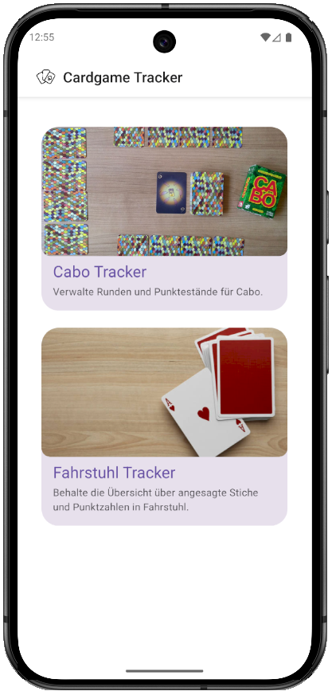

# Cardgame-Tracker
Eine React Native Expo App zum Verfolgen von Punkteständen in verschiedenen Kartenspielen.

## Unterstützte Spiele

### Fahrstuhl
Verfolge Punktestände für Fahrstuhl
- Trage angesagte und erreichte Stichzahlen je Spieler und Runde ein
- Automatische Punkteberechnung basierend auf den Fahrstuhl-Regeln
- Bearbeitung bei Fehleinträgen möglich
- Verfolge im Leaderbord den Punkteverlauf im Spiel
- Teile die Ergebnisse mit Freunden

### Cabo
Verfolge Punktestände für das Cabo-Kartenspiel mit den gleichen Funktionen wie bei Fahrstuhl und folgende andere:
- Sage "Cabo" an, wenn du glaubst, die niedrigste Punktzahl zu haben
- Verfolge Kamikaze-Kombinationen (2x12 und 2x13)
- Automatische Punkteberechnung basierend auf den Cabo-Regeln

## Screenshots

### Dark Mode

    
    
    
    
    

### Light Mode

    
    
    
    
    

